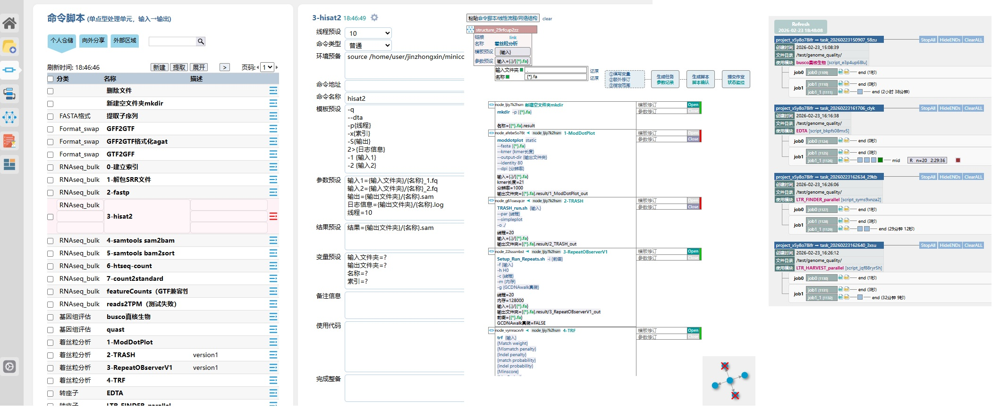

A bioinformatics workflow management system based on Slurm features a module management subsystem that stores bioinformatics software commands into a database in a predefined format, defining them as modules. These modules can be combined into new modules through serial or networked connections, enabling the rapid construction of complex workflows. The task submission subsystem transforms these modules into corresponding job scripts, which are nested in the form of main jobs, sub-jobs, and minimal job units. The scripts comply with the specifications of the Slurm job scheduling system and incorporate runtime progress reporting. Integrated with front-end and back-end technologies, this workflow management system facilitates visual interaction, enhancing the efficiency of managing and utilizing bioinformatics software commands and promoting the rapid advancement of life sciences.

